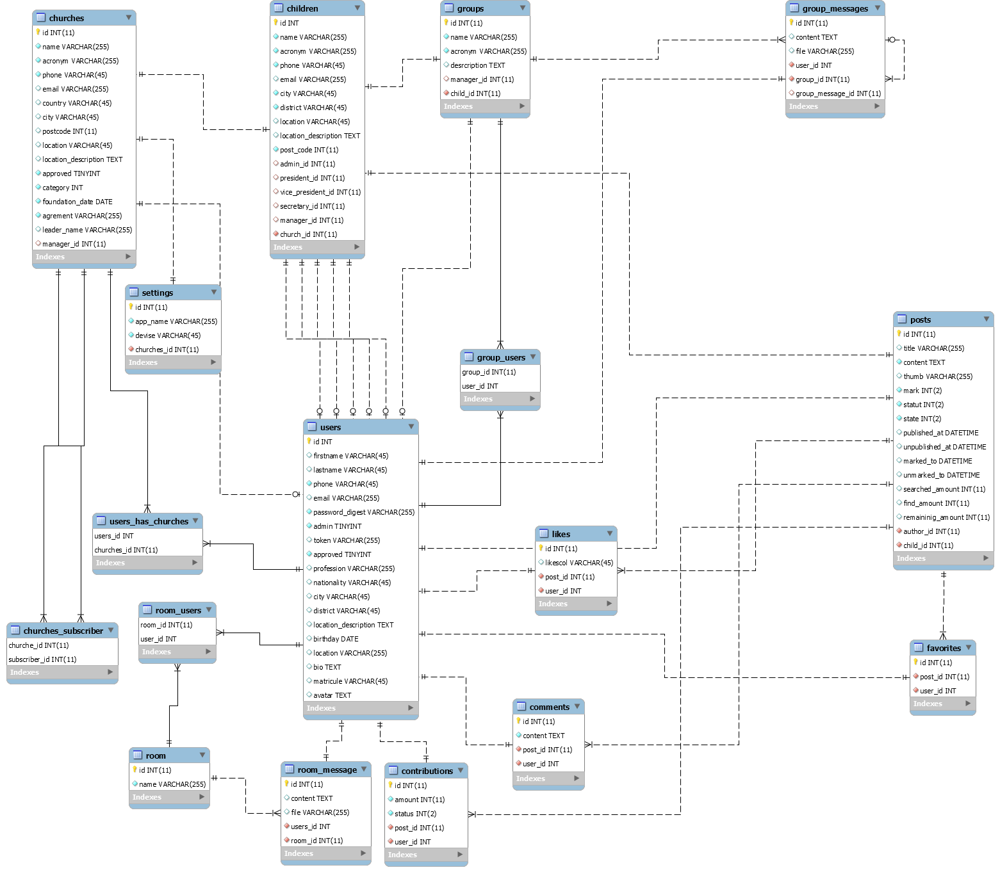

## Notes

#### 1. Version
  - Rails 5.2.5
  - Ruby 2.6.5
  
### 2. Technologies
  - #### Ajax comments
    Thanks to ajax requests, users (church devotees) can comment on their church posts without reloading the post page. Once the comment is submitted, a webSocket event will be sent to update in real time the comments of all users who will have this publication page displayed on the screen.

  - #### Favorites
    The users, (church faithful can favor the publications they do not wish to lose in the max and also the publications of type events in which they wish to participate
    
  
### 3. Other technologies
  - #### WebSockets
    I use the webSocket to update in real time certain elements on the screen of all users (church faithful)
    - When a user clicks like, all user's screen is updated
    - When a user makes a comment, everyone else will get it in real time
    - We will also use it for chat in church groups

### 5. shared files
  ###### [CATALOG DESIGN AND TABLE DEFINITION](https://docs.google.com/spreadsheets/d/11kvptQy_YhfZyh2LUTB9hzUpy8cjNbjusj1xo3lgPOs/edit?usp=sharing)

### 6. Screenshots
  #### Screen transition
  

  #### ER diagram
  [MySQL Workbench ER Diagram](https://drive.google.com/file/d/1CGvpwK31TULrE3COJSewdzTVCTglhjNp/view?usp=sharing)

  
    