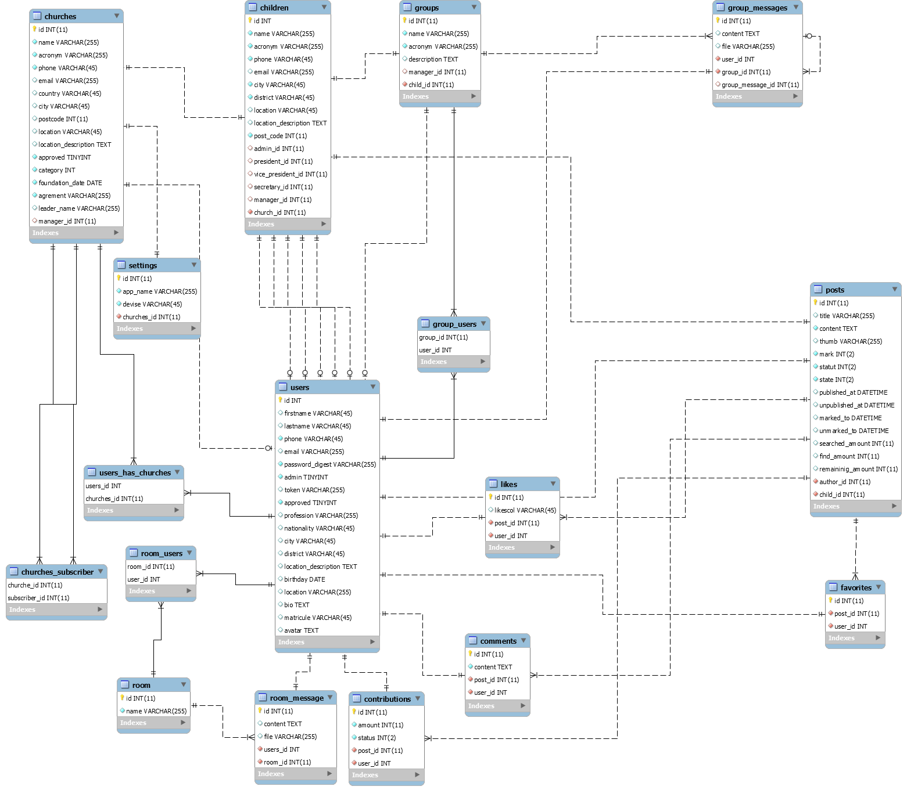

## Notes

#### 1. Version
  - Rails 5.2.5
  - Ruby 2.6.5
  
### 2. Technologies
  - Ajax comments
  - Favorites
  
### 3. Other technologies
  - WebSockets

### 5. shared files
  ###### [CATALOG DESIGN AND TABLE DEFINITION](https://docs.google.com/spreadsheets/d/11kvptQy_YhfZyh2LUTB9hzUpy8cjNbjusj1xo3lgPOs/edit?usp=sharing)

### 6. Screenshots
  #### Screen transition
  

  #### ER diagram
  
    